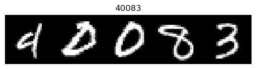

# Sequence MNIST OCR Challenge

Optical Character Recognition model to read sequences of handwritten digits from the [MNIST](http://yann.lecun.com/exdb/mnist/) dataset in Python.


```
sequence-mnist
│   README.md
│   submission.ipynb - Jupyter Notebook containing model training and prediction   
│
└───sequence_mnist
│   │
│   └───data
│   │   │   __init__.py
│   │   │   file_utils.py - contains utilities for downloading/loading MNIST dataset
│   │   │   mnist.py - class for loading MNIST dataset
│   │
│   └───model
│       │   __init__.py
│       │   dataloader.py - contains SequenceMNIST class for loading sequences of digits
│
└───tests
    │   __init__.py
    │   test_sequence_mnist.py - tests for the SequenceMNIST class

```

## Data

We have provided a class for generating the train and test datasets which you can import and use as follows:
```python
from sequence_mnist.model import SequenceMNIST

import matplotlib.pylab as plt


train = SequenceMNIST(train=True, root="/tmp/data", download=True)
test = SequenceMNIST(train=False, root="/tmp/data", download=True)

train_it = iter(train)
image, labels = next(train_it)

title = "".join(str(v) for v in labels)
plt.title(title)
plt.imshow(image, cmap="gray")
plt.show()
```


**You are free to modify this class as you see fit, provided the base behavior is maintained (e.g 5 28x28 pixel images 
stacked horizontally with accompanying labels).**

## Discussion points
At final interview, we may wish to discuss:
1. Data quality and impact on performance
2. Any pre/post-processing steps you have implemented
3. The choice of algorithm and its suitability for the problem at hand
4. The choice of evaluation metrics used to assess model performance
5. Any trade-offs you have made or may have to make when putting this model into production
6. Model explainability